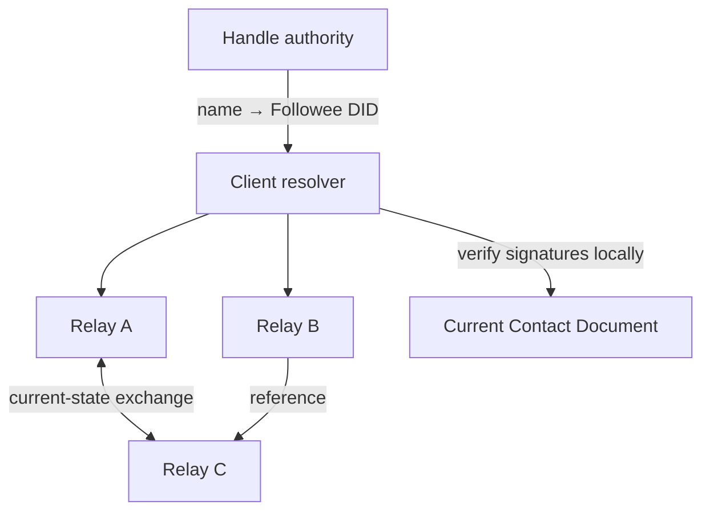

# Followee

## A Relay Protocol for Following People, Not Platforms

**Author: Mats Helander**
**Whitepaper draft v0.6**
**4 August 2026**
**Licence: [Creative Commons Attribution 4.0 International](https://creativecommons.org/licenses/by/4.0/)**

> Followee is a protocol for resolving a permanent, self-certifying identifier to its owner's current public contact information through an open network of independently operated relays.

---

## Abstract

People do not merely publish *on* platforms. Over time, they move between them. A writer may move a blog, a creator may change social networks, a project may replace its website, and a community may migrate its forum or feed. Platform-local usernames and subscriptions do not survive those moves. Followers are therefore attached to the platform that currently mediates the relationship rather than to the person or organisation they intended to follow.

Followee separates the durable act of following a subject from the temporary locations at which that subject publishes. Each subject creates a permanent self-certifying identifier, called a **Followee DID**. The identifier is a compact hash commitment to an **Authority Descriptor** containing an initial root public key and a commitment to one normally offline revocation public key. The active controller signs compact, full-state **Identity Records** containing that descriptor and the subject's current contact links. Independent **relays** store, exchange, and resolve those records. A client may query several relays, verify every result locally, and select the winning admissible signed record without trusting any relay as an identity authority.

There is no global ledger, shared blockchain, consensus group, proof-of-work competition, token, canonical relay, or mandatory history. Each relay is simply a partial replicated map from Followee DIDs to signed records or references to other relays. Relay-local update cursors permit efficient exchange of current state without turning the network into a shared event chain.

Human-readable handles remain federated in the useful sense of email: a domain controls names under that domain. `alice@example.com` is resolved by `example.com`, preferably through WebFinger. Once a client has obtained and followed Alice's Followee DID, the client keeps the Followee DID—not the handle—and can continue resolving Alice's signed contact record even if the old domain later forgets her.

Followee can therefore launch before a relay network exists. One blogger controlling one domain can expose a WebFinger handle mapping and a link to the current signed Identity Record; a reader verifies that record locally and follows the resulting DID. Relays add replication, DID-only lookup, and independence from the original domain later. This zero-relay bootstrap makes deployment incremental rather than requiring new global infrastructure before the first useful follow.

Followee is transport- and platform-neutral. Relays may run on conventional servers, peer-to-peer nodes, smart-contract networks, or any other environment capable of storing and serving the protocol objects.

## 1. Status and scope

This document is a design whitepaper and an implementable protocol profile, not yet a final standards document. Capitalised requirement terms such as **MUST**, **SHOULD**, and **MAY** indicate intended normative behaviour in a later specification.

Followee's core purpose is deliberately narrow:

> Given a Followee DID, discover its winning admissible contact record under a small, self-contained authority and ordering rule.

Followee does not attempt to establish a person's legal identity, guarantee that one human controls only one Followee DID, prove the truth of statements made in contact records, maintain a social graph, host posts, rank content, or make relays agree upon a global history.

The motivating application is an open publishing ecosystem:

1. publishers expose RSS, Atom, ActivityPub, websites, repositories, or other public endpoints;
2. Followee keeps followers connected to publishers as those endpoints change; and
3. independent indexers combine feeds and compete on discovery, ranking, moderation, presentation, and business model.

Only the identity continuity layer is specified here. Publishing engines and indexers can be developed independently.

## 2. The problem

RSS solved decentralised publication better than it solved decentralised reach. A user who says “follow me” must often provide a blog URL, recommend a reader, explain feed subscription, and repeat the exercise after moving. Centralised social platforms hide that complexity behind stable platform usernames, but the stability belongs to the platform. The platform can change discovery rules, suppress reach, suspend the account, alter its economics, or disappear.

A useful open alternative needs four properties:

1. **Permanent machine identity.** A following list must store something independent of domains and platforms.
2. **Current contact discovery.** The permanent identifier must resolve to changing public endpoints.
3. **Human discovery.** A person who knows only `alice@example.com` needs a standard way to discover Alice's permanent identifier.
4. **Plural infrastructure.** No single registry, relay, blockchain, or algorithm should become the new platform.

These requirements divide cleanly into two authority relationships:

- A **Followee DID controller** is authoritative for the contact record signed by the key applicable under the DID's fixed authority rule.
- A **domain** is authoritative for the mapping of names under that domain to Followee DIDs.

Neither authority can safely make the other's statement. A signed identity record may claim `alice@example.com`, but that claim is not a proof that the domain assigned the name. Conversely, a domain may map `alice@example.com` to a Followee DID, but it cannot forge records signed by that Followee DID.

## 3. Design principles

Followee follows several rules that keep the protocol small and its failures local.

### 3.1 Self-authenticating records

Every full Identity Record is verifiable using only the record and its Followee DID. The record carries an Authority Descriptor whose hash must reproduce the DID. An ordinary record is checked against the descriptor's root public key. A root-revoked record additionally reveals the precommitted revocation public key and is signed by that key. A relay never becomes an identity authority merely by storing or forwarding a record.

### 3.2 No global canon

Relays may know different subsets of identities and may learn records in different orders. They do not vote, mine blocks, elect leaders, or share a canonical log. A client may consult one relay or many according to its own availability and assurance requirements.

### 3.3 Full state, not deltas

Every Identity Record contains the complete current Contact Document. It does not depend on earlier records. A fresh relay can validate and serve the latest record without acquiring history.

### 3.4 Fixed, one-way control

A Followee DID has exactly two precommitted authority states. Initially the root key committed by its Authority Descriptor signs records. A record signed by the precommitted revocation key irreversibly revokes the root and makes every root-signed record ineligible. The revocation key then remains the active key for the life of the DID.

Followee v1 has no control-event chain, delegation-event structure, quorum, arbitrary authority successor, or repeated key rotation. The one-way transition is deliberately narrow: it provides an escape from root loss or compromise without creating a branch-selection problem.

### 3.5 Recipient verification

Every relay and client applies its own signature, size, schema, and timestamp checks. A sender's claim that a record is valid—or that another relay holds it—has no special standing. Relay validation is local admission hygiene, not a statement that downstream clients may trust.

### 3.6 Bounded work

Signed inputs are still untrusted inputs. Wire objects, strings, arrays, nesting, batches, reference traversal, and future timestamps are all bounded.

### 3.7 Compatibility where it helps

Followee adopts useful existing standards instead of inventing near-equivalents:

- the [W3C DID Core](https://www.w3.org/TR/did-core/) data model and resolver concepts;
- deterministic [CBOR](https://www.rfc-editor.org/rfc/rfc8949) for compact structured records;
- [COSE Sign1](https://www.rfc-editor.org/rfc/rfc9052) for the signed envelope;
- [WebFinger](https://www.rfc-editor.org/rfc/rfc7033) for domain-qualified human handles.

Compatibility is a tool rather than a mandate to inherit every feature of those systems.

## 4. System model

### 4.1 Components

| Component | Purpose | Authority |
| --- | --- | --- |
| **Followee DID** | Permanent hash commitment to a fixed Authority Descriptor | Its committed root key, then its precommitted revocation key |
| **Identity Record** | Signed, timestamped, full current state | The DID's active authority state |
| **Contact Document** | Public profile and service links | A claim by the Followee DID controller |
| **Relay** | Stores and exchanges records or references | None over identity content |
| **Handle authority** | Maps `name@domain` to a Followee DID | The named domain, at lookup time |
| **Resolver/client** | Queries relays, verifies records, selects current state | Its own verification policy |

### 4.2 Topology



The diagram is intentionally not a chain. Relays form an opportunistic graph. The client can query any useful portion of that graph.

### 4.3 What a following list stores

A following list stores Followee DIDs. It may cache handles, display names, avatars, and the last valid Identity Record for presentation and offline use, but those are mutable conveniences. The Followee DID is the durable key.

## 5. Followee DIDs

### 5.1 DID form

The proposed canonical textual form is a multibase-encoded multihash of a canonical Authority Descriptor:

```text
did:flw:<multibase-encoded-multihash-of-authority-descriptor>
```

The specification calls this a **Followee DID** to distinguish the method from DIDs in general. User interfaces may shorten the label to **Followee ID**.

For example, illustratively:

```text
did:flw:zQm...authority-descriptor-digest...
```

The short method name `flw` is deliberate. The protocol and product remain **Followee**, but the method prefix is repeated in signed records, following lists, API requests, relay synchronization, indexes, and archives. Saving five bytes relative to `did:followee:` is negligible in one record but permanent across every encoded and replicated DID. User interfaces should display “Followee” rather than expose the abbreviation unnecessarily, and implementations may store a parsed method tag internally instead of retaining the textual prefix.

The Authority Descriptor is a small, immutable deterministic-CBOR map containing:

| Field | Meaning |
| --- | --- |
| `descriptorVersion` | Authority Descriptor schema version |
| `rootKey` | Canonical public-key encoding including its cryptographic suite |
| `revocationCommitment` | Full cryptographic commitment to the canonical revocation-key encoding and suite |

Conceptually:

```text
descriptorInput =
    "Followee/AuthorityDescriptor/v1" ||
    deterministicCBOR(authorityDescriptor)

Followee DID =
    "did:flw:" || multibase(multihash(SHA-256, descriptorInput))
```

The normative specification will freeze the exact domain-separation bytes and multiformat encodings. The important properties are that the DID commits to the entire descriptor, the hash encoding is self-describing but constrained by the Followee method profile, and every full Identity Record carries the descriptor inline. The descriptor is not a genesis record and requires no historical or registry lookup.

This design deliberately does **not** expose the root key from the DID string alone. A verifier resolving contact state already has an Identity Record; it obtains the descriptor there, reproduces the DID, and then verifies the record signature. Hashing the descriptor roughly halves the durable identifier compared with embedding both root material and a revocation commitment in the DID, at the bounded cost of carrying the descriptor in each full record. That is favourable because DIDs appear in following lists, indexes and repeated lookups far more often than controllers publish new full records.

Followee v1 permits exactly the multihash `sha2-256` code with a 32-byte digest. A verifier MUST reject every other algorithm code or digest length, irrespective of whether it is registered by multiformats. This one-entry profile prevents a subject from selecting a weaker binding while retaining an unambiguous encoding for future specification versions. A later version may permit another algorithm for newly defined Authority Descriptor versions; it never reinterprets an existing Followee DID under a different algorithm.

Multihash agility cannot rescue an existing DID after its hash function becomes unsafe, because changing the commitment necessarily changes the DID. It can only provide a clean encoding for newly created DIDs. A future specification that deprecates a function SHOULD distinguish refusing to create new DIDs from refusing to verify existing ones: the latter destroys continuity and is justified only when the old function no longer satisfies the required verification security. Migration of an affected identity follows the explicit fresh-DID bridge described in Section 5.4.

The v1 method retains the full SHA-256 result rather than truncating it. Followee DIDs are machine identifiers; humans normally exchange domain-qualified handles. Saving a few more characters is not worth weakening the commitment's general collision resistance or introducing an unusual security parameter into an identifier intended to be permanent.

The revocation key itself is not exposed until it is used, but its commitment is fixed inside the Authority Descriptor from creation. The commitment is mandatory because it cannot be added safely after the root has been lost or compromised. Canonical key encodings include suite identifiers so the same bytes cannot be interpreted under different algorithms.

The method can be implemented experimentally without central permission. Before production interoperability is claimed, its specification SHOULD be submitted to the [W3C DID Extensions method registry](https://www.w3.org/TR/did-extensions-methods/) to reduce the risk of a conflicting interpretation of `did:flw:`. Registration is discovery metadata rather than ownership of the namespace; the published specification remains the authority for method behaviour.

### 5.2 Authority binding

A verifier parses the method-specific identifier, decodes its multihash, reads the Authority Descriptor carried by the record, and recomputes the domain-separated descriptor digest. The record belongs to the Followee DID only if the result matches. The verifier then obtains the initial cryptographic suite and root public key from that bound descriptor. No registry or earlier record is required.

For a root-revoked record, the record also supplies the revocation public key. The verifier hashes its canonical suite-and-key encoding using the descriptor's fixed commitment procedure, compares the result with `revocationCommitment`, and verifies the signature with the revealed key. A valid revocation-key record changes authority state irreversibly: the root is thereafter revoked and the revealed key is the DID's permanent active key.

This is called **root revocation** because the decisive security fact is that the old root is removed from the candidate set. It also restores practical control when the root was lost or copied, but it is not arbitrary key recovery: the replacement was fixed when the DID was created, and there is no authority-successor choice or second transition.

### 5.3 Cryptographic suites

The Followee method profile fixes its permitted descriptor-hash algorithms separately from its signature suites. In v1 the hash profile contains only full-length SHA-256, as specified in Section 5.1.

Followee should maintain a small signature-suite registry rather than allow arbitrary algorithms. The first implementation profile SHOULD require Ed25519 and MAY add P-256 when implementation and hardware-wallet interoperability justify it. Root keys and revocation keys each carry or imply a registered suite. Each suite definition fixes:

- public-key encoding;
- COSE algorithm identifier;
- signature encoding and malleability rules;
- verification procedure; and
- maximum key and signature lengths.

The Ed25519 profile MUST follow [RFC 8032](https://www.rfc-editor.org/rfc/rfc8032) and state exact verification behaviour, including rejection of non-canonical encodings and disallowed small-order points and the required cofactor handling. Naming an algorithm is not a complete interoperability or malleability profile.

Unknown suites are unsupported, not malformed. A relay cannot validate such a record and therefore MUST NOT admit it into its current-record map. An implementation may retain unsupported bytes in a separate bounded diagnostic cache, but that cache is outside the relay protocol and cannot affect resolution or synchronization.

### 5.4 Root custody

Followee specifies verification, not custody. The root private key may be kept in:

- user-managed encrypted storage;
- a hardware security key, secure enclave, or hardware wallet;
- an external signing vault or HSM; or
- an application-specific encrypted vault.

The revocation private key SHOULD be generated separately, stored offline or under materially different controls, and tested before the DID is published. Until activation it need not sign routine records. After activation it becomes the everyday authority and can no longer serve as an offline reserve.

Encrypted storage and access-control systems can assist with custody. Applications may also expose a narrow remote-signer interface so several devices can request signatures without copying a private key. Such coordination improves operations but does not change protocol authority.

Loss or compromise of the root can be survived only while the revocation key remains safe. Loss of both keys makes the DID unupdatable. Compromise of the revocation key is terminal. These are explicit limits of the one-way design.

After root revocation, the DID has no remaining protocol recovery path. A controller who wants restored recovery margin SHOULD create a fresh Followee DID while the old one remains controlled, publish reciprocal migration fields in the old and new Contact Documents as described in Section 8.3, and invite followers to re-follow deliberately. The old DID is then a bridge for an orderly migration, not a protocol-level transfer: clients MUST NOT replace a followed DID automatically merely because the records contain a verified migration link.

## 6. Identity Records

### 6.1 Record body

An Identity Record body contains:

| Field | Meaning |
| --- | --- |
| `protocolVersion` | Followee record schema version |
| `id` | The canonical Followee DID being updated |
| `timestamp` | Bounded Unix timestamp used for record ordering |
| `authority` | Integer authority state: `0` = `root`, `1` = `rootRevoked` |
| `authorityDescriptor` | Complete immutable descriptor whose hash reproduces `id` |
| `revocationKey` | Present if and only if `authority` is `rootRevoked` |
| `validUntil` | Optional Unix timestamp after which the record is stale |
| `contact` | Complete current Contact Document |
| `extensions` | Optional namespaced extension values |

The Followee DID is derivable from the Authority Descriptor, but its inclusion in the signed body is deliberate redundancy. It makes the intended identity context explicit, permits a cheap mismatch rejection before hashing the descriptor, and provides defence in depth against cross-context misuse. Matching this field is necessary but not sufficient: a verifier must still confirm independently that the Authority Descriptor hashes to the same DID.

Illustrative CBOR diagnostic notation:

```cbor
{
  0: 1,                                      / protocolVersion /
  1: "did:flw:zQm...",                       / id /
  2: 1785589200123,                          / timestamp_ms /
  3: 0,                                      / authority: root /
  4: {                                       / authorityDescriptor /
    0: 1,                                    / descriptorVersion /
    1: h'...canonical root suite and key...', / rootKey /
    2: h'...full revocation commitment...'    / revocationCommitment /
  },
  6: 1788181200123,                          / optional validUntil_ms /
  7: {                                       / contact /
    0: "Alice Example",                      / displayName /
    1: "Writer and protocol enthusiast",     / summary /
    2: "https://example.net/avatar.webp",    / avatar URI /
    3: ["acct:alice@example.com"],           / alsoKnownAs /
    4: [
      {
        0: "blog",
        1: "Feed",
        2: "https://alice.example/feed.xml",
        3: "application/atom+xml",
        4: "Writing"
      }
    ]
  }
}
```

Numeric field labels keep the signed form compact. A later normative specification should publish the schema in [CDDL](https://www.rfc-editor.org/rfc/rfc8610) with test vectors.

A post-revocation record uses the same full-state shape, but sets `authority` to integer `1`, includes the canonical revocation public-key encoding at key `5`, and is signed by that revealed key. A root record uses integer `0` and MUST NOT contain key `5`; its presence makes the record malformed. Conversely, a root-revoked record without key `5` is malformed. The Contact Document remains complete; the record does not point backward to a control event or earlier profile.

### 6.2 Signed envelope

The record body is encoded using deterministic CBOR and carried as the payload of a COSE Sign1 object. The protected COSE headers identify the permitted signing algorithm. A fixed external additional-authenticated-data value such as `Followee/IdentityRecord/v1` provides domain separation.

The verifier:

1. parses the COSE Sign1 envelope within size and depth limits;
2. confirms deterministic CBOR, the record schema, and the exact integer authority encoding;
3. confirms that the body contains the expected canonical Followee DID;
4. hashes the carried Authority Descriptor and confirms that it reproduces that DID;
5. parses the applicable suite and key from the descriptor or revealed revocation key;
6. confirms that the protected COSE algorithm matches that suite;
7. for a root record, confirms that `revocationKey` is absent and verifies with the descriptor's root key;
8. for a root-revoked record, requires `revocationKey`, confirms that it matches the descriptor commitment, and verifies with that key; and
9. applies timestamp, expiry, authority-state, and admission checks.

Checking only the signed `id` field is a critical implementation error. The descriptor-binding check in step 4 is what proves that the advertised root and revocation commitment belong to that DID.

The wire record contains no self-asserted record hash. Verifiers compute [SHA-256](https://www.rfc-editor.org/rfc/rfc6234) over the deterministic CBOR **record body**, excluding the COSE envelope and signature. This local digest is used for duplicate detection and deterministic tie-breaking. It is derived metadata, not an authoritative wire field.

### 6.3 Full-state rule

Every accepted record supersedes the previous Contact Document in full. Missing fields mean absent fields; they do not mean “retain the prior value.” Delta records are not defined in v1.

This permits a relay that has never seen the Followee DID before to validate the newest record independently.

## 7. Timestamp ordering

### 7.1 Why neither fixed counters nor unbounded integers suffice

A wrapping fixed-width counter lets indefinitely retained stale records become “new” again after wraparound. Serial-number arithmetic works only when sufficiently old state expires; Followee deliberately permits old state to survive in slow or archival relays.

An arbitrary-precision natural number avoids wraparound but creates an allocation and comparison attack. A signed record could contain an absurdly large integer. Capping the integer merely recreates a maximum that an authorised signer can select.

Without a shared history or consensus mechanism, a fixed-size ordering value can recover from hostile maxima only by being constrained by some external value that progresses independently. Followee therefore uses a bounded timestamp.

### 7.2 Bounded record timestamp

Each record contains:

```text
timestamp_ms: uint64
```

Within one authority state, records compare first by `timestamp_ms`. The greater admissible timestamp wins. Equal timestamps are resolved by a deterministic body-digest rule in Section 7.5.

The timestamp is **not evidence of when the record was created**. It is an ordering value constrained to a plausible interval by each recipient's clock.

### 7.3 Signer algorithm

Let `previous` be the greatest timestamp among **all** records known to the signer—locally emitted or externally observed—that are not ahead of its trusted local time. A locally emitted future record is ignored by the same rule as a future record learned from a relay. Given local Unix time `now` in milliseconds:

```text
timestamp = max(now, previous + 1)
```

For the first record, the signer uses `now`.

The addition MUST use checked arithmetic. A previously admitted timestamp cannot be near `uint64.max` because it would violate the future bound.

Incrementing the previous timestamp handles multiple updates generated during one millisecond without a second counter. A sufficiently extreme burst may advance logical record time ahead of wall-clock time; if it reaches the future-skew boundary, the signer waits for wall-clock time to catch up.

A signer does not chase a relay's merely tolerated future timestamp. It may use a synchronized operating-system clock, hardware clock, or independent time sources. Relay-reported time and network medians can produce warnings, but MUST NOT silently become authoritative input supplied by an untrusted relay.

A signer without local state SHOULD resolve the Followee DID through several relays before issuing an update. If the resulting timestamp would exceed a small signer-side lead allowance, it SHOULD wait or require an explicit warning acknowledgement. A remote signing service may retain `previous` and serialize requests as an implementation convenience, but protocol correctness does not depend on one continuously stateful signer; offline and multi-device conflicts remain possible.

Ignoring a previously emitted premature record prevents clock-error lockout, but does not erase that record from a relay which accepted it. When wall-clock time eventually reaches its timestamp, it may become admissible and temporarily outrank intervening records. Signing tools SHOULD warn about known stranded future records and the time at which they may activate. The controller can then issue a later correction once that time arrives.

A root-revoked record is subject to the same premature check. Because it is commonly created under urgency and perhaps on unfamiliar recovery hardware, a signing tool MUST perform a hard clock-sanity check before emitting it rather than relying only on an ordinary device clock.

### 7.4 Future bound

The v1 profile proposes:

```text
MAX_FUTURE_SKEW = 300_000 milliseconds  / five minutes /
```

A recipient MUST NOT treat a record as currently admissible when:

```text
record.timestamp_ms > recipient.current_time_ms + MAX_FUTURE_SKEW
```

Such a record is **premature**, rather than cryptographically invalid. An ingress relay SHOULD reject it rather than retain an unbounded future queue. It may be submitted again after time advances. A resolver MUST apply the same check when selecting a result. A relay MUST repeat the check when serving a record so that a clock corrected backwards does not continue exporting state that its present clock considers premature. If it retains such a record, it returns a usable relay reference or a per-DID `premature` error rather than Full or Absent; this serving decision does not itself change stored identity state.

Consequences:

- `uint64.max` is bounded in representation and rejected as impossibly far in the future;
- a maximally future but accepted timestamp can delay a corrective update by approximately the allowed skew, not forever;
- an honest relay whose clock is far ahead may accept unusable future records, but other recipients reject them;
- an honest relay whose clock is far behind rejects ordinary records and becomes locally unhelpful; and
- healthy relays converge as their clocks enter the admissible interval.

Clock correctness affects a relay's usefulness, not its authority over the network. Followee therefore has loose wall-clock coordination, but no shared clock or clock consensus.

### 7.5 Equal-timestamp conflicts

If two distinct valid records in the same authority state have the same Followee DID and timestamp, the record whose locally computed body digest is lexicographically lower wins. Digests compare as 32 unsigned bytes from left to right. The comparison excludes the signature so randomized or malleable signature bytes cannot alter ordering.

A relay stores only the winner, not an unbounded conflict set. If it later receives a lower-digest winner at the same timestamp, it replaces its current record and increments its relay-local update number. The rule converges for every finite set of conflicting records regardless of arrival order. Signers SHOULD still avoid equal timestamps because replacing a record by digest order says nothing about authorial intent.

### 7.6 Optional validity horizon

An Identity Record MAY contain `validUntil_ms: uint64`. When present, it MUST be greater than or equal to `timestamp_ms`. Once a recipient's current time exceeds `validUntil_ms`, the record remains cryptographically authentic but is **stale**. A client may warn, refuse sensitive actions, or continue showing cached contact data according to product policy. Relays may retain and serve stale records; expiry is not deletion and cannot prove that a newer record exists.

Omitting `validUntil` means indefinite validity. The field is useful for controllers that prefer fail-closed contact data, but it is optional because mandatory expiry would make identity resolution depend on perpetual republishing.

### 7.7 Root-revocation precedence

Records belong to one of two authority states:

1. **root**, signed by the public key in the DID-bound Authority Descriptor; or
2. **root revoked**, signed by the revealed key whose commitment is in that descriptor.

Any schema-conformant, signature-valid, non-premature `rootRevoked` record has absolute precedence over every root record, regardless of their relative timestamps. Once a relay or client has observed such a record, it MUST persist a sticky `rootRevoked` state and MUST never again select, admit as current, or automatically restore a root-signed record for that DID. Ordering by timestamp and digest occurs only within the winning authority state. An expired root-revoked record still activates this transition: `validUntil` describes contact freshness, not authority expiry.

The first root-revoked record is itself a complete Identity Record with safe current contact data. There is no instruction to find the “last good” root record. This matters under compromise: an attacker may publish a bad record for now and pre-sign another for the future, but activation of the revocation key removes **all** root-signed records—old, current, future, seen, and not yet seen—from the candidate set. No sandwich remains to select.

A participant that has never learned of the revocation can still be shown withheld root state. This is an availability and rollback limitation, not an ambiguity in verification. Query diversity, cached sticky state, and propagation of the root-revoked record mitigate it without pretending that a global broadcast occurred.

## 8. Contact Document profile

Followee uses a deliberately restricted profile compatible with the useful parts of DID Core. A resolver can project a locally validated Followee record into an `application/did+json` DID Document containing:

- `id`: the Followee DID;
- the currently applicable `verificationMethod`: the descriptor's root, or the revealed precommitted revocation key after transition;
- `alsoKnownAs`: claimed handles and alternate identifiers; and
- `service`: current interaction endpoints.

The Followee-native Contact Document additionally exposes the reciprocal migration fields in Section 8.3. A DID Core JSON projection SHOULD include them only through a registered extension representation whose semantics remain intact; silently recasting them as `alsoKnownAs` or an ordinary service would lose the distinction between a directional claim and a verified reciprocal migration link.

Followee does not use DID Core's general controller replacement, multiple mutable verification keys, key agreement, capability invocation, capability delegation, or arbitrary deactivation machinery. A general control graph would require history retrieval and fork resolution. The fixed one-way root revocation retains independently verifiable full records while addressing the most important compromise case.

### 8.1 Core contact fields

| Field | Meaning | Trust rule |
| --- | --- | --- |
| `displayName` | Human-readable name | Signed self-description |
| `summary` | Short public description | Signed self-description |
| `avatar` | URI of an image | Link only; content is not signed by implication |
| `alsoKnownAs` | Handles or alternate identifiers as URIs | Claims requiring authority-specific verification |
| `services` | Ordered public service endpoints | Signed endpoint claims |
| `migration` | Optional predecessor and successor Followee DIDs | Directional claims; verified as a migration link only by reciprocal current records |

No binary avatar, post, attachment, or other large content is embedded. Such content is linked by URI.

### 8.2 Service entries

Each service entry contains:

| Field | Required | Meaning |
| --- | --- | --- |
| `id` | Yes | Unique local token within this Contact Document |
| `type` | Yes | Registered or namespaced service type |
| `endpoint` | Yes | URI of the service |
| `mediaType` | No | Expected representation, when useful |
| `label` | No | Human-readable label |
| `language` | No | BCP 47 language tag for the label/content |
| `rel` | No | Link relation or application hint |

Initial conventional service types may include `Website`, `Feed`, `Profile`, `ActivityPub`, `Messaging`, `Repository`, `Payment`, and `Other`. Their names describe endpoints; they do not elevate those endpoints into trusted identity authorities.

Array order is presentation order. Clients may reorder or filter services according to user preference.

### 8.3 Reciprocal migration links

A Contact Document MAY contain a bounded `migration` map with either or both of these fields:

| Field | Meaning |
| --- | --- |
| `predecessor` | The one Followee DID from which this DID claims to continue |
| `successor` | The one Followee DID to which this DID currently invites followers to move |

Each value is one canonical Followee DID and MUST differ from the DID of the containing record. Lists are not permitted in v1. A DID may contain both fields when it is one link in a longer migration chain.

Each field alone is only a signed directional claim. Given old DID A and new DID B, a client treats A → B as a **verified migration link** only when:

1. the winning admissible Identity Record for A contains `migration.successor = B`;
2. the winning admissible Identity Record for B contains `migration.predecessor = A`; and
3. both records pass the ordinary descriptor, signature, timestamp, and sticky authority-state rules.

This reciprocal construction supplies signatures from both applicable authorities without defining another signed object or control event. If A's root has been revoked, a root-signed A record cannot establish the link; the current root-revoked record must do so. A missing, unavailable, stale, or non-reciprocal side does not establish a verified migration link; clients distinguish incomplete checking from a completed non-reciprocal check as specified in Section 13.4. Relays treat these fields as ordinary opaque contact data and never derive authority state from them.

A verified migration link is therefore **live reciprocal state**, not a permanent historical certificate. It remains verifiable only while both selected records remain discoverable and admissible. A cached older record may remain cryptographically authentic after it becomes stale or is superseded, but it no longer establishes the current reciprocal link. Controllers who want a migration bridge to remain useful to late-arriving followers SHOULD keep the old DID's linking record published through several relays and refresh it before `validUntil`, when that field is used, for as long as they want the bridge to operate.

A verified migration link proves only that the two currently selected records mutually endorse the direction A → B. It does not prove legal identity, exclusivity, or permanence; it does not transfer authority over either DID; and it MUST NOT cause a client to replace a followed DID automatically. A client MAY present a deliberate re-follow action. Record ordering permits either controller to withdraw or change its current claim, and normal resolution budgets and cycle detection apply when inspecting longer chains.

This design borrows the useful old-to-new linkage of did:dht's Previous record while preserving Followee's one-record authority model. did:dht carries a detached signature from the old identity in the new document. Followee instead resolves two ordinary full records because its old root may have been revoked and the Followee DID intentionally does not expose verification material by itself.

A future profile could define a detached predecessor attestation carried by B, containing A's Authority Descriptor and a domain-separated signature by an A key over the ordered pair `(A, B)`. Such a proof would add roughly a few hundred bytes to B's full records and would preserve signature verifiability after A disappears. It would not, by itself, prove that a root-signed endorsement was not superseded by a later root revocation. Treating a detached revocation-key signature as the revocation transition would instead introduce another authority-changing object. Followee v1 deliberately declines both complications; a later extension may revisit the trade-off if durable historical migration proof proves more valuable than live reciprocal state.

### 8.4 Extensibility

The Contact Document is a bounded CBOR map. Core keys use compact integer labels. Extension keys use an allocated extension range or a namespaced structure defined by a public extension specification.

Relays need not understand Contact Document fields to verify and replicate a supported record. Clients MUST ignore unknown optional fields. Extensions cannot weaken signature, size, timestamp, or canonical-encoding requirements.

### 8.5 Proposed v1 limits

| Item | Maximum |
| --- | ---: |
| Complete COSE Identity Record | 16 KiB |
| Contact Document | 12 KiB within the record cap |
| CBOR nesting depth | 8 |
| Total map and array members | 256 |
| UTF-8 display name | 256 bytes |
| UTF-8 summary | 2,048 bytes |
| Any URI | 2,048 bytes |
| `alsoKnownAs` entries | 32 |
| Service entries | 64 |
| Migration predecessors and successors | 1 each |
| Service label or identifier | 256 bytes |

These values are proposed interoperability limits, not measurements of any particular host's capacity. Operators may impose stricter admission quotas but MUST NOT produce nominally conforming records that exceed the protocol maxima.

The 16 KiB record limit is an aggregate encoded-size ceiling and is binding even when every individual field is within its own maximum. Parsers MUST enforce it before allocating from field-declared sizes; per-field maxima are additional constraints, not a promise that all maxima can be combined in one record.

## 9. Human-readable handles

### 9.1 Domain-qualified names

Human handles use email-like syntax:

```text
alice@example.com
```

As with email, `alice@example.com` and `alice@another.example` are distinct names. The domain controls its own namespace. There is no global registrar for the local part and no requirement that all domains use the same account system.

Local parts remain case-sensitive protocol strings, but a handle authority SHOULD NOT assign ASCII-case variants under one domain to different Followee DIDs. It SHOULD reject the variant or map it as an alias to the same DID. This keeps exact WebFinger verification while avoiding spoken handles whose ownership changes with capitalization.

### 9.2 WebFinger resolution

The preferred lookup mechanism is WebFinger:

```http
GET https://example.com/.well-known/webfinger
    ?resource=acct:alice@example.com
```

Illustrative response:

```json
{
  "subject": "acct:alice@example.com",
  "links": [
    {
      "rel": "https://followee.example/spec/rel/did",
      "type": "application/did+json",
      "href": "did:flw:zQm..."
    }
  ]
}
```

The relation URI above is illustrative; the normative specification will assign one stable absolute Followee relation URI. Followee does not reuse `rel="self"`, because that relation is already used by deployed federated protocols and would make content negotiation and account discovery needlessly ambiguous.

The HTTPS origin authenticates the domain through the ordinary Web PKI. Alternative domain-controlled mechanisms, including DNSSEC-backed records, may be standardised later, but clients need only one interoperable mechanism for the initial proof of concept.

A handle authority MAY also link to or return the current signed COSE Identity Record. That domain then acts as a zero-relay bootstrap publisher: clients still verify the record cryptographically, and relays may ingest it later. This improves first publication and recovery when no relay yet knows the DID. It does not provide DID-only availability after the domain disappears, so durable following still benefits from relays or another independently discoverable publisher endpoint.

When activating root revocation, a controller SHOULD update every domain-hosted current-record endpoint it still controls before or alongside relay publication. A new follower has no sticky authority state and commonly reaches the domain first; serving the root-revoked full record there gives that follower the strongest available bootstrap path. This remains an availability recommendation rather than proof that no stale domain or relay exists.

### 9.3 Verification direction

Handle verification always runs from the claimed authority to the Followee DID:

```text
acct:alice@example.com
        ↓ WebFinger at example.com
did:flw:zQm...
```

The inverse claim in a Contact Document is merely a discovery hint until checked:

```text
Followee DID record claims acct:alice@example.com
        ↓ client asks example.com
verified only if the domain maps it back to the same Followee DID
```

A relay does not need to verify every claimed handle while ingesting a record. Handle authority is checked when a client needs to display or rely upon that handle.

### 9.4 Moving between domains

Suppose Alice was discovered as `alice@old.example`, and the old domain later removes the mapping. Existing followers still hold Alice's Followee DID and resolve her records through relays. Alice may add `acct:alice@new.example` to her next Contact Document. A client verifies the new handle by asking `new.example` and marks it verified only if that domain maps back to Alice's existing Followee DID.

The old domain is not required to redirect forever. This is the central continuity property Followee provides.

## 10. Relay state

### 10.1 Partial current map

A relay maintains one bounded partial current map:

```text
Followee DID → {
  entry: Full(IdentityRecord) | Ref(RelayIndex),
  authorityState: Unknown | Root | RootRevoked,
  lastUpdated
}
```

`RootRevoked` is established only after the relay validates a root-revoked full record. Converting that full record to a reference MUST preserve the authority state; otherwise an old root record could silently resurrect. Merely receiving a reference never establishes authority state, because a reference is unverified routing information. A relay that previously knew only a reference may therefore use `Unknown`.

There is no separate monotonically growing revocation set. Authority state is ordinary metadata on an admitted map entry and remains within the relay's existing identity quota. An operator may drop the entire entry, including its state. If it later re-admits that DID without rediscovering revocation, it is a fresh observer subject to the withholding limitation in Section 7.7.

It is neither required nor expected to hold every Followee DID. Operators choose what to admit, retain, sponsor, or reference.

### 10.2 Full-record and reference tiers

A relay may divide capacity into:

- a **full-record tier**, containing complete, locally validated Identity Records; and
- a **reference tier**, containing compact pointers to relays believed to hold a record.

When the full-record tier reaches its configured limit, the relay may keep or create a reference rather than retaining another full record. This permits broad discovery without requiring every relay to store every Contact Document.

Within its chosen admission and retention policy, a relay SHOULD prefer retaining a `RootRevoked` entry—degraded from a full record to a reference when a usable reference is available—over dropping that entry entirely. The reference is cheap, its preserved local authority state prevents resurrection of an old root record at that relay, and no unbounded storage obligation is created because the entry remains subject to the relay's ordinary identity quota.

References are availability hints, not attestations. The referenced relay may be offline, may have forgotten the record, or may return another reference.

### 10.3 Relay directory

Each relay publishes an enumerated directory of known relay endpoints. Internal references store a bounded integer index into that directory rather than repeating long URLs. Directory entries may include:

- transport endpoint URI;
- supported protocol transports;
- optional operator metadata;
- capability flags; and
- the directory generation in which the index is valid.

Indices SHOULD remain stable and SHOULD NOT be silently reused within the same directory generation.

### 10.4 Lazy path compression

If relay A asks relay B for a Followee DID and B returns a reference to C, A may store a direct reference to C. It need not store a reference to B that merely points to C. This is lazy path compression.

A does not need to fetch and verify the full Identity Record merely to compress the path. A malicious B can therefore misdirect A, but cannot forge the eventual record. The consequence is reduced availability through A, not false identity state.

If C points to D, a client may continue to D. Clients MUST detect cycles and enforce traversal budgets.

## 11. Relay protocol semantics

The core data model is transport-neutral. HTTP, WebSocket, libp2p, or another transport may expose equivalent operations. Conformance is capability-based rather than all-or-nothing.

### 11.1 Capability classes

| Class | Required capabilities |
| --- | --- |
| **Resolver** | Resolve one or more Followee DIDs |
| **Relay** | Resolver plus relay metadata and current-state synchronization |
| **Ingress Relay** | Relay plus publication/admission endpoint |
| **History Relay** | Relay plus optional relay-local historical export |

A private application resolver may deliberately expose no synchronization or publication endpoint. Participation is voluntary.

### 11.2 `relayInfo`

Returns:

- protocol versions;
- relay instance identifier;
- update-cursor generation;
- supported cryptographic suites;
- record and batch limits;
- capability flags;
- transport endpoints; and
- current relay-directory generation.

### 11.3 `resolve`

Input:

```text
Followee DID
```

Output:

```text
Full(recordBytes)
| Ref(relayIndex, directoryGeneration)
| Absent
| Error(reason)
```

Batch resolution MUST be available to a conforming Resolver, with bounded item and response-byte limits. Batching is important both for following-list startup cost and for avoiding one network round trip per identity; it does not remove the need for privacy-aware query shaping.

The response contains candidate bytes, a routing hint, local absence, or a per-DID error. It contains no relay-supplied validity or verification flag. A stored Full record that has become premature under the Relay's current clock produces `Error(premature)` unless a usable Ref is returned; Absent remains distinct from that known but presently unservable state.

### 11.4 `publish`

An Ingress Relay accepts a signed record candidate and applies its admission policy. Admission may require payment, authentication, sponsorship, proof of work at the application layer, a per-Followee DID quota, or nothing at all. These are operator policies and are not identity-validity rules.

A successful publication response means only that this relay admitted the record. It does not imply global propagation.

### 11.5 Ingress algorithm

For a full record candidate, a relay performs bounded checks in this order where practical:

1. reject an oversized envelope before deep parsing;
2. parse bounded CBOR and COSE structures;
3. validate canonical encodings and schema limits;
4. parse the Followee DID and its hash suite;
5. verify that the signed body names the same Followee DID;
6. validate the Authority Descriptor and confirm that its hash reproduces the DID;
7. enforce the exact authority-dependent schema, including `revocationKey` presence or absence;
8. verify the applicable root or committed revocation-key signature;
9. reject a premature timestamp according to the relay's current clock;
10. if the stored state is `RootRevoked`, drop a root record without changing relay state or update number;
11. apply root-revocation precedence and persist the `RootRevoked` transition if applicable;
12. compare timestamp and deterministic body digest within the applicable authority state;
13. drop a losing record or exact duplicate without changing relay update state; and
14. on a winning record—including a lower digest at an equal timestamp—replace current state and assign a new relay-local update number.

Cheap policy checks such as quotas and envelope-size limits may run before signature verification. A relay MUST nevertheless validate the signature itself before a candidate may enter or replace its current-record map, appear in `changesSince`, or be served as a full record. Without this rule, anyone could cheaply forge a high timestamp for any Followee DID, evict useful state, and turn relays into amplifiers for invalid bytes.

An implementation MAY place candidates in a bounded quarantine and verify them asynchronously, but quarantined bytes are not relay state. A relay may remember internally that stored bytes have already passed its own checks so it need not repeat expensive verification on every query.

There is no transmitted `verified` flag, validation certificate, or relay assurance field. A relay's prior work is not evidence for another participant. Every receiving relay validates a full record before admitting it, and every client validates a full record before using it.

## 12. Efficient relay synchronization

### 12.1 The requirement

Relay A needs to ask relay B, “Which current records changed since I last synchronized with you?” The record timestamps cannot answer that question: B may newly ingest a perfectly valid record created long ago. The relevant order is when B changed its own current map.

### 12.2 Relay-local update numbers

Each relay assigns an update number when, and only when, an admitted change alters current identity state. Receiving a losing record, an exact duplicate, or any root record after `RootRevoked` does not increment the number. Receiving a newly winning lower-digest record at the same timestamp does increment it, as does the irreversible transition to `RootRevoked`.

Each current entry stores its most recent relay-local update number:

```text
Followee DID → (current entry, lastUpdated)
```

If one Followee DID changed three times since a peer last synchronized, only the latest current entry is returned. The peer need not process all three historical transitions.

### 12.3 Opaque cursors and reset

A synchronization cursor is relay-local and opaque to peers. Conceptually it contains:

```text
Cursor = (relayUpdateGeneration, updateNumber)
```

`updateNumber` may be a bounded `uint64`. The relay chooses a new random update generation when it resets, restores incompatible state, compacts in a way that invalidates cursors, or approaches counter exhaustion. A peer presenting an unknown generation receives `ResetRequired` and performs a fresh bounded synchronization.

This is safe because the cursor orders observations from one relay instance; it is not an identity timestamp and is never compared across relays.

A backup SHOULD capture each entry's authority state atomically with its current entry. After restoring an older snapshot, the relay resets its cursor generation and SHOULD mark restored root or unknown entries as requiring refresh. Before serving a restored root full record, it SHOULD re-resolve that DID through several peers. This reduces accidental resurrection but cannot prove that no withheld revocation exists; with respect to state omitted by the snapshot, the relay is a fresh observer. Client-side sticky authority state remains the security boundary for an existing follower.

### 12.4 `changesSince`

Input:

```text
(cursor, itemLimit, byteLimit)
```

Output:

```text
{
  entries: [(Followee DID, Full | Ref, lastUpdated)],
  nextCursor,
  hasMore
}
```

Entries are ordered by `lastUpdated`. `nextCursor` advances only through the returned range, preventing pagination gaps.

The operation returns current tuples, not a historical event stream. Relay B may have learned today a record whose signed timestamp is months old; if it changed B's current map today, it is included.

### 12.5 Storage housekeeping

Converting a full record into a reference for storage reasons does not represent a new identity record and SHOULD NOT masquerade as one in the identity-update cursor. The conversion MUST preserve the entry's `authorityState`, including `RootRevoked`. Relay implementations may maintain a separate storage-generation indicator if peers need to learn such housekeeping changes.

### 12.6 Pull strategy

Relays choose their own peers, schedules, identities of interest, and budgets. They may:

- poll continuously;
- poll only active peers;
- synchronize only followed or locally requested Followee DIDs;
- rely primarily on client-driven discovery;
- require reciprocal service or payment; or
- remain selfish and expose resolution without sharing updates.

The protocol does not require altruism.

## 13. Client resolution

### 13.1 Resolution procedure

Given a Followee DID, a client:

1. checks its last locally validated cached record and sticky authority state;
2. queries one or more configured relays;
3. follows references subject to hop, relay, time, and byte budgets;
4. verifies every full record independently;
5. ignores malformed, unsupported, bad-signature, oversized, or premature records;
6. if any valid root-revoked record is known, permanently excludes every root-signed record;
7. within the applicable authority state, selects the greatest admissible timestamp; and
8. at an equal timestamp, selects the lexicographically lowest locally computed body digest.

The client may return cached state with a freshness warning if no relay answers. Absence from one or many relays is not proof that the Followee DID does not exist.

### 13.2 Suggested traversal limits

The v1 client profile should begin with conservative defaults:

| Budget | Suggested default |
| --- | ---: |
| Initial relays queried | 3 |
| Maximum distinct relays visited | 16 |
| Maximum reference depth | 8 |
| Maximum concurrent requests | 4 |
| Maximum total response bytes per resolution | 1 MiB |
| Resolution deadline | 10 seconds |
| Maximum migration hops | 2 |

Applications may offer stronger or lighter profiles. Cycle detection for relay references uses the pair of relay identity and Followee DID; migration traversal separately tracks visited Followee DIDs.

A migration hop is one predecessor or successor edge beyond the initially resolved DID. All migration lookups initiated by one user operation MUST share that operation's aggregate relay, response-byte, concurrency, and deadline budgets. A new hop MUST NOT reset those budgets. Clients may let a user start a separate explicit operation to inspect further provenance.

### 13.3 Client-led graph traversal

Where public relay queries are inexpensive, a browser or other client can perform much of the fan-out and reference traversal. This shifts discovery cost toward the party requesting the result and reduces the need for every relay to poll and fully replicate the network.

Because Identity Records are self-verifying, a client need not trust the transport or relay for authenticity. It still relies on the queried service for availability and must independently validate the returned record bytes. It SHOULD preserve a learned `rootRevoked` state even if its cached full record expires or is evicted.

### 13.4 Migration prompts

When a followed DID's selected record names a successor, a client may resolve that DID as an additional bounded lookup. The client tracks one of three local presentation states:

| State | Meaning | Ordinary presentation |
| --- | --- | --- |
| **Verified** | Both selected admissible records were obtained and pass the reciprocal test in Section 8.3 | The client may explain the migration and offer a deliberate re-follow action |
| **Checked but unverified** | A selected admissible counterpart was obtained, but it does not reciprocate | Suppress the claimed relationship; diagnostic views may explain the failed local check |
| **Not checked** | The reciprocal test was not completed because it was deferred or because of budget exhaustion, timeout, unavailability, or absence of an admissible counterpart | Do not present the relationship; the client may offer an explicit action that starts a separate check |

Only **Verified** authorises migration-oriented presentation. It still does not authorise silent replacement, copying of trust decisions, or deletion of the old DID from the following list. A cautious client retains the old DID until the user acts and may preserve it as provenance afterwards.

**Not checked** is not a negative result and MUST NOT be cached or reported as though reciprocity failed. An explicit check is a new user operation and receives fresh aggregate budgets under Section 13.2. **Checked but unverified** may also be retried later because either controller can publish new full state, but it does not justify a migration prompt in the meantime.

The inverse discovery path is more dangerous. Any new DID can self-assert `migration.predecessor` naming a prominent identity. Until the predecessor's selected record reciprocates, an ordinary client MUST NOT present that claim as “formerly”, “continues from”, provenance, migration, or any other relationship. It SHOULD suppress the claim entirely rather than display it with a caveat. If the state is **Not checked**, a client MAY offer a generic verification control, but that control MUST NOT imply that the named predecessor endorsed the claim. Diagnostic and developer views may expose the raw signed field while clearly treating it as unverified data.

## 14. Optional relay history

History is not required to validate current Followee state. A relay may nevertheless expose an append-only local history for audit, diagnosis, research, or peer recovery. The format and indexing of that history are outside the core protocol.

Crucially:

- every relay has its own history;
- relays log only records or transitions they chose to admit;
- histories may start late and contain gaps relative to another relay;
- a relay need not reconstruct missing global history; and
- no collection of relay histories forms a shared Followee blockchain.

History can explain what a relay saw. It does not decide which network-wide event was canonical.

## 15. Trust and security analysis

### 15.1 Forged records

A relay cannot forge a valid record without the private key for the applicable authority state. Clients first confirm that the record's Authority Descriptor hashes to the DID. They then verify a root signature using the descriptor's root key, or verify a root-revoked signature only after the revealed key matches the descriptor's commitment.

### 15.2 Replay and rollback

An old valid record remains authentic but loses to a later admissible timestamp in the same authority state. A malicious relay may withhold newer state and return only an old record. Querying multiple relays and retaining a local last-good timestamp and authority state mitigates this availability attack. A client SHOULD warn before replacing a cached record with an earlier timestamp and ordinarily MUST NOT do so automatically. Once root revocation is known, rollback to root state is forbidden rather than merely warned about.

### 15.3 Timestamp-maximum attacks

The fixed-width timestamp prevents allocation attacks. Future-time admission prevents a record submitted now from jumping arbitrarily far ahead: one immediately submitted hostile timestamp can delay an ordinary correction only within the future-skew window. A party with root signing access can nevertheless pre-sign records carrying later timestamps and submit them as those timestamps become admissible.

Root revocation is the escape hatch for that stronger attack. It does not select a supposedly good root record from before the compromise. It invalidates the entire root-signed authority state, including pre-signed future records. The first root-revoked record supplies complete replacement contact state.

### 15.4 Broken relay clocks

A relay whose clock is far ahead may admit future records, but healthy recipients independently reject them. A relay whose clock is far behind rejects current records and becomes irrelevant. Relays repeat the future check when serving records so a backward clock correction suppresses records that are no longer locally admissible.

### 15.5 Equal-timestamp equivocation

Relays store only the deterministic lower-digest winner at a timestamp. This bounds storage and converges without making arrival order authoritative. Followee does not provide global equivocation evidence or punishment: the losing record need not be retained, and the digest is an ordering device rather than proof of intent.

### 15.6 Root-key compromise

Anyone who copies the root private key can issue root records indistinguishable from the owner's records until the revocation key is activated. Even temporary access permits pre-signing. The safe response is therefore total root revocation, not a timestamp-specific exception.

Per-record rejection instructions are deliberately absent. A command such as “reject timestamp T” would require clients and relays to retain a forever-growing blacklist of sticky exceptions, undermine the current-full-state model, and still leave uncertainty about other records signed during compromise. One irreversible authority-state bit bounds storage and closes the entire compromised class.

The revocation private key has greater long-term sensitivity than the initial root: once exposed, it can activate itself and there is no later protocol key. Its loss before activation also removes the recovery path. Followee cannot distinguish the rightful holder from a thief who possesses the applicable key.

After activation, prudent controllers may use reciprocal migration fields in the old and fresh DIDs' current records and ask followers to move deliberately. This restores a new offline revocation path without pretending that a verified migration link transfers authority.

### 15.7 No arbitrary transfer, automatic succession, or retirement

Followee v1 defines no privileged transfer to a newly chosen key, terminal retirement, or automatic successor DID. Reciprocal migration fields authenticate the currently selected records' mutual endorsement, but clients must not treat that relationship as exclusive, irrevocable, or authority-bearing.

The revocation key does not nominate an arbitrary authority successor. If it could, two valid successor records would recreate the control fork the protocol is designed to avoid; resolving it would require history, consensus, or treating the recovery key as a permanent meta-controller. The precommitted key instead becomes the authority directly.

An applicable authority may issue different migration claims over time or equivocate. Ordinary full-record ordering determines the claim selected from the records a client can see, and reciprocity determines whether the other DID currently agrees. Multiple historical or withheld endorsements can therefore exist without creating an identity-control fork precisely because none can move followers automatically. A “retired” profile value may be expressed as ordinary contact content, but it has no special ordering semantics.

### 15.8 Handle poisoning

An Identity Record's `alsoKnownAs` field cannot assign a domain handle. Clients verify the handle by querying the domain. A malicious handle authority can reassign names under its own domain, just as an email provider can reassign an email address, but it cannot change the Followee DID stored by existing followers or sign that Followee DID's records.

### 15.9 Relay poisoning

A malicious relay may omit records, return stale records, return unusable references, claim absence, or waste client time. It cannot make an invalid signature valid. Diversity, local caching, traversal limits, and operator reputation address the remaining availability problem.

### 15.10 Reference loops and amplification

Clients track visited relays and enforce hop, request, time, and byte budgets. Relays bound batch sizes and directory responses. A reference is never followed recursively without resource accounting.

### 15.11 Resource exhaustion and Sybil identities

Creating public keys is cheap. A relay therefore cannot promise free permanent full storage for every valid Followee DID. Admission, payment, quotas, sponsorship, eviction, references, and selective synchronization are legitimate operator choices. Cryptographic validity is necessary but never sufficient for resource admission.

### 15.12 Privacy

Followee records are public by design. Controllers should publish links rather than secrets or sensitive personal data. Stable Followee DIDs permit correlation across services; users may create separate Followee DIDs for separate personas. Applications should not imply that resolving a Followee DID proves a real-world person behind it.

A client does not send a social graph object to a relay, but its resolution requests may reveal much of that graph. Batching improves efficiency while making the queried set more visible to one operator. Clients concerned about this leakage SHOULD cache aggressively, divide lookups among independent relays, query through a personal relay or privacy-preserving transport, and avoid refreshing every followed DID in one distinctive batch. Claimed human handles SHOULD be verified lazily when displayed or relied upon, then cached under a bounded domain-policy TTL rather than rechecked on every record read.

## 16. Eventual convergence and non-guarantees

### 16.1 Convergence claim

For a particular Followee DID, assume:

1. only finitely many admissible records are issued during an interval;
2. participating relays have clocks within the allowed operational tolerance;
3. all records in that finite set eventually reach those relays; and
4. each participating relay retains any previously learned `RootRevoked` state for the map entry under consideration.

Then those relays converge on the same record regardless of arrival order. Root-revoked authority outranks root authority; within the selected authority state, the greatest timestamp wins; and at that timestamp the lexicographically lowest deterministic body digest wins.

The claim concerns finite conflicts and eventual delivery, not instantaneous agreement. A participant from which the revocation record is withheld may temporarily retain root state because Followee has no global broadcast oracle. A relay that drops an entry entirely, or restores a snapshot from before the transition, falls outside assumption 4 and re-enters as a fresh observer until it rediscovers the revocation.

### 16.2 What Followee does not guarantee

Followee does not guarantee:

- global record availability;
- global completeness of relay state;
- total relay agreement at every instant;
- proof of a person's civil identity;
- one identity per person;
- recovery after loss or compromise of the precommitted revocation key;
- truth of profile statements or linked content;
- permanent handle ownership;
- permanence, continued availability, or continued verifiability of a migration link; or
- censorship resistance against every relay simultaneously.

Its guarantee is narrower and useful: any supplied full record can be checked independently, independently discovered admissible records can be ordered without a global ledger, and a learned root revocation permanently excludes the compromised root state.

## 17. Economics and sustainability

The base protocol contains no token, gas unit, fee schedule, advertising format, or subsidy. Relay operation nevertheless has plausible beneficiaries and funding models:

- blogging and social applications run relays for fast handle completion and profile resolution;
- indexers run relays because identity continuity improves their feeds;
- publishers sponsor their own records or preferred relay sets;
- communities operate curated relays as shared infrastructure;
- operators sell higher quotas, persistence, synchronization, or service guarantees;
- public-good organisations sponsor open resolvers; and
- clients perform reference traversal themselves, reducing background polling.

Advertising may fund applications or indexers, but Identity Records should remain controller-authored contact state. A relay must not inject ads into a signed record. It may present surrounding UI or offer separately identified metadata.

These mechanisms do not prove that relay operation will remain economically decentralised. Scale, latency, reputation, and bundling may still favour large operators. Followee's defence is cheap exit rather than a promise of equal market share: following lists contain DIDs, records are portable signed objects, and clients can add or replace relays without asking the incumbent to export identity ownership.

## 18. Why there is no shared blockchain

A shared blockchain would add:

- a mempool;
- transaction fees and a token economy;
- block production and fork choice;
- liveness and censorship assumptions;
- global replication of identities unwanted by many operators; and
- a consensus problem stronger than the contact-continuity problem requires.

Proof of work is valuable when strangers must agree on scarce, irreversible ownership without a trusted clock. Followee records are not transfers of a scarce asset. The DID's fixed authority rule already determines who may sign, and later contact records can safely supersede earlier ones without global finality.

Removing general mutable control was decisive. Once Followee stopped trying to solve arbitrary key-transfer continuity, limited recovery to one precommitted transition, and confined normal operation to contact continuity, a shared chain ceased to provide a proportionate benefit.

## 19. Relationship to existing systems

Followee borrows heavily from existing work, but its particular combination is narrower than a general-purpose DID method and more portable than a platform account.

| System | What Followee reuses or learns | Why it is not the same protocol |
| --- | --- | --- |
| [Nostr](https://github.com/nostr-protocol/nips/blob/master/01.md) | Key-based identity, relays, replaceable profile metadata, and deterministic equal-time selection | Followee resolves a bounded contact document rather than a general event stream; it adds DID representation, committed root revocation, relay references, current-state cursors, and domain-authoritative handles. Nostr's [NIP-05](https://github.com/nostr-protocol/nips/blob/master/05.md) and [NIP-46](https://github.com/nostr-protocol/nips/blob/master/46.md) are useful precedents for human discovery and remote signing. |
| [did:key](https://w3c-ccg.github.io/did-key-spec/) | A DID can deterministically expose verification material without a registry | `did:key` is intentionally static. Followee adds signed mutable contact resolution and a one-way, precommitted root-revocation state. Using a distinct method makes those resolution and authority semantics explicit instead of hiding them in an unrelated profile convention. |
| [did:plc](https://web.plc.directory/spec/v0.1/did-plc) | Compact identifiers and operational recovery are valuable | did:plc uses an operation history, a strongly consistent directory, and a time-bounded higher-authority rewrite window. Followee avoids a canonical directory and history dependency by permitting only one precommitted authority transition. |
| [did:dht](https://did-dht.com) ([repository copy](https://github.com/decentralized-identity/did-dht/blob/main/spec/spec.md)) | Self-certifying distributed mutable identity, bounded-time sequence handling, deterministic conflicts, and cryptographic old-to-new DID linkage | did:dht uses the Mainline DHT and second-resolution Unix timestamps as BEP44 sequence numbers. For unseen state it consults peers; it recommends rejecting timestamps over two hours ahead; and at an equal sequence number it retains the lexicographically higher raw payload of up to 1,000 bytes. Followee uses heterogeneous partial relays, a five-minute v1 future bound, the lower fixed 32-byte body digest, and relay-local cursors separating observation order from signed record time. did:dht's Previous record and key-compromise guidance inform Followee's fresh-DID bridge; Followee uses reciprocal current full records so its existing ordering and revocation rules apply without automatic transfer. |
| [IPNS](https://specs.ipfs.tech/ipns/ipns-record/) | Signed mutable pointers, sequence/validity concepts, and independently distributed records | IPNS primarily names content paths and uses DHT/PubSub routing. Followee names a contact document, uses bounded wall-clock ordering plus deterministic ties, and combines partial relays with federated handle discovery. Optional `validUntil` follows the useful principle that authenticity and freshness are separate. |
| [KERI](https://trustoverip.github.io/kswg-keri-specification/) | Precommitted future keys and end-verifiable key management address real controller-continuity problems | Followee adopts the smallest useful instance of KERI-style pre-rotation: exactly one precommitted authority transition. KERI supports continuing chained key-event logs, sequence numbers, duplicity handling, and optional witness agreement; Followee deliberately drops that generality so full records remain verifiable without a key-event history or witness quorum. |
| [ActivityPub/Mastodon migration](https://docs.joinmastodon.org/user/moving/) | User-facing migration proves that people need continuity across hosts | Account migration depends on cooperation and features of the old and new server software, and not every relationship or object necessarily moves. A Followee following list already contains a platform-independent DID; services change inside its signed contact record. |

The closest conceptual relative is Nostr metadata over plural relays. Followee deliberately does less at the event layer and more at the resolution layer. It specifies only current contact state, makes relay storage partial and referential, separates handle authority from identity authority, and supplies a bounded recovery rule. Those choices are intended to make Followee usable underneath RSS, ActivityPub, Nostr, websites, and systems not yet designed.

## 20. Proof-of-concept

The first proof of concept should test the loose component—the relay network—horizontally rather than hide it inside a complete blogging product.

### 20.1 Minimum deployment

- three independently operated relay nodes;
- three domain-qualified handle authorities;
- one browser resolver;
- one local root-and-revocation-key wallet/signing tool; and
- several test Followee DIDs with changing Contact Documents.

### 20.2 Required scenarios

1. **Independent publication.** A record is published to one relay and later discovered through another.
2. **Out-of-order delivery.** Relays receive records in different orders and retain the greatest admissible timestamp.
3. **Late old discovery.** A relay newly ingests an old record without confusing record time with relay update order.
4. **Coalesced synchronization.** Three changes to one Followee DID produce one current tuple in `changesSince`.
5. **Equal-timestamp conflict.** Relays receive two equal-time records in opposite orders and converge on the same lower-digest body without storing both.
6. **Future attack.** A year-2500 record admitted by a deliberately broken relay is rejected by healthy relays and clients.
7. **Behind-clock relay.** A relay set to an old date rejects current records and does not poison peers.
8. **Handle migration.** A follower discovers a Followee DID through one domain, that mapping disappears, and the follower still discovers a new verified handle through the Followee DID record and another domain.
9. **Reference traversal.** A full relay is replaced by a direct reference; the browser follows a multi-hop path with cycle protection.
10. **Cursor reset.** A relay changes update generation and peers perform a controlled resynchronization.
11. **Capacity pressure.** Full-record and reference caps are exercised without unbounded allocation.
12. **Optional history.** One relay exports its own accepted history without implying a network-wide chain.
13. **Root-revocation sandwich.** A compromised root publishes one bad current record and one pre-signed future record; a valid root-revoked full record makes both permanently ineligible.
14. **Withheld revocation.** A fresh client shown only root state behaves consistently with the documented availability limitation, while any client that learned revocation never rolls back.
15. **Validity horizon.** An expired record remains verifiable but is reported as stale according to client policy.
16. **Multi-device collision.** Two offline signers produce the same timestamp and deterministic ordering reconverges all relays.
17. **Descriptor substitution.** A record carrying a modified, non-canonical, or unrelated Authority Descriptor fails to reproduce the target Followee DID and is rejected before its signature can affect relay state.
18. **Reciprocal migration.** Old DID A names new DID B and B names A; clients verify both current records and offer, but never perform, a deliberate re-follow. Removing either direction, substituting an invalid record, or revoking A's root makes the corresponding link unverified until valid reciprocal current state is available.
19. **Migration decay, states, and budgets.** A verified link ceases to verify when either side is unavailable or stale. Budget exhaustion produces **Not checked**, not a failed reciprocity result; a separate explicit check receives fresh aggregate budgets. A completed mismatch produces **Checked but unverified**, an unreciprocated predecessor claim remains suppressed in the ordinary UI, and cyclic or long chains remain within the shared two-hop, byte, relay, and deadline budgets.

### 20.3 Success criteria

The proof of concept succeeds if:

- no relay must trust another relay's claims about record validity;
- a new relay can validate a current record without record history;
- no Authority Descriptor can be substituted without changing the Followee DID;
- healthy clients reject bad signatures and implausible future timestamps;
- root revocation removes every root-signed record from selection without a blacklist;
- existing followers remain attached to a Followee DID after handle migration;
- reciprocal migration can be verified without granting either DID authority over the other or changing a following list automatically;
- unverified predecessor claims and migration-chain traversal cannot create an impersonation display, turn an incomplete check into a negative result, or reset client resource budgets;
- relay synchronization exchanges current state rather than redundant history;
- storage and traversal remain bounded under adversarial inputs; and
- no component depends upon a globally privileged relay.

## 21. Open specification work

The architecture is sufficiently settled for implementation, but the following artefacts must be frozen before claiming interoperability:

1. the exact `did:flw` full-hash encoding and publication of the DID Method specification;
2. the Authority Descriptor, revocation-key commitment, domain separation, and integer authority-state encoding;
3. the v1 descriptor-hash profile, initial signature-suite registry, strict verification rules, and test vectors;
4. the normative CDDL record and Contact Document schema, including bounded reciprocal migration fields;
5. deterministic CBOR, body-digest, and COSE profile details;
6. exact media types and domain-separation value;
7. the dedicated WebFinger relation URI and direct-record convention;
8. transport API mappings, including mandatory bounded batch resolution;
9. relay-directory and cursor wire schemas, plus normative local rules for per-entry authority state and restore-time refresh;
10. conformance limits and error codes;
11. DID Document projection rules, including a semantics-preserving migration extension representation;
12. an optional remote-signer request interface suitable for multi-device applications;
13. cross-implementation conformance and adversarial test suites; and
14. submission of the completed method specification to the W3C DID Extensions registry.

These are specification tasks, not unresolved architectural questions.

## 22. Conclusion

Followee makes one durable promise:

> Follow a subject's Followee DID once; continue discovering where that subject now chooses to be found.

It obtains that property without replacing today's platforms with tomorrow's central registry. Identity Records are bound to self-certifying identifiers with a fixed, one-way authority rule. Domains provide familiar human names without controlling existing follow relationships. Relays replicate partial current state without a shared blockchain. Clients verify records and choose infrastructure for themselves.

That small separation—people from platforms, identity authority from name authority, and authenticity from availability—is enough to support a larger open publishing ecosystem. Blogs can remain easy to create. Indexers can compete freely. Feeds can remain decentralised. Followee supplies the missing continuity between them.

---

## Acknowledgements

Development of this whitepaper benefited from iterative drafting, analysis, and adversarial review using OpenAI's ChatGPT and Anthropic's Claude. These systems are acknowledged as tools rather than authors.

## Licence and disclaimer

Copyright © 2026 Mats Helander.

This whitepaper is licensed under the [Creative Commons Attribution 4.0 International licence](https://creativecommons.org/licenses/by/4.0/). It may be shared and adapted, including commercially, provided appropriate attribution is given, a link to the licence is supplied, and changes are indicated.

To the extent permitted by applicable law, this work is provided **as is**, without warranties or conditions of any kind. No author or contributor accepts liability for loss arising from its use or implementation. Implementers are responsible for their own security analysis, testing, legal review, and deployment decisions.

Software implementations are separate works and are intended to be released under the [MIT License](https://opensource.org/license/mit). The `LICENSE` file distributed with each implementation is authoritative for that software.

## References

1. W3C, [Decentralized Identifiers (DIDs) v1.0](https://www.w3.org/TR/did-core/).
2. W3C, [Decentralized Identifier Resolution](https://www.w3.org/TR/did-resolution/).
3. IETF, [RFC 8949: Concise Binary Object Representation (CBOR)](https://www.rfc-editor.org/rfc/rfc8949).
4. IETF, [RFC 9052: CBOR Object Signing and Encryption (COSE): Structures and Process](https://www.rfc-editor.org/rfc/rfc9052).
5. IETF, [RFC 8610: Concise Data Definition Language (CDDL)](https://www.rfc-editor.org/rfc/rfc8610).
6. IETF, [RFC 7033: WebFinger](https://www.rfc-editor.org/rfc/rfc7033).
7. Multiformats, [Protocol family overview](https://multiformats.io/).
8. IETF, [RFC 8032: Edwards-Curve Digital Signature Algorithm (EdDSA)](https://www.rfc-editor.org/rfc/rfc8032).
9. Nostr, [NIP-01: Basic protocol flow description](https://github.com/nostr-protocol/nips/blob/master/01.md), [NIP-05: Mapping Nostr keys to DNS-based internet identifiers](https://github.com/nostr-protocol/nips/blob/master/05.md), and [NIP-46: Nostr remote signing](https://github.com/nostr-protocol/nips/blob/master/46.md).
10. W3C Credentials Community Group, [The did:key Method](https://w3c-ccg.github.io/did-key-spec/).
11. did:plc contributors, [did:plc Specification v0.1](https://web.plc.directory/spec/v0.1/did-plc).
12. IPFS, [IPNS Record specification](https://specs.ipfs.tech/ipns/ipns-record/) and [IPNS concepts](https://docs.ipfs.tech/concepts/ipns/).
13. Mastodon, [Moving or leaving accounts](https://docs.joinmastodon.org/user/moving/).
14. IETF, [RFC 6234: US Secure Hash Algorithms](https://www.rfc-editor.org/rfc/rfc6234).
15. Decentralized Identity Foundation, [The DID DHT Method Specification 1.0](https://did-dht.com) ([repository copy](https://github.com/decentralized-identity/did-dht/blob/main/spec/spec.md)), especially its rotation, conflict-resolution, data-conflicts, and key-compromise sections.
16. Trust Over IP Foundation, [Key Event Receipt Infrastructure specification](https://trustoverip.github.io/kswg-keri-specification/).
